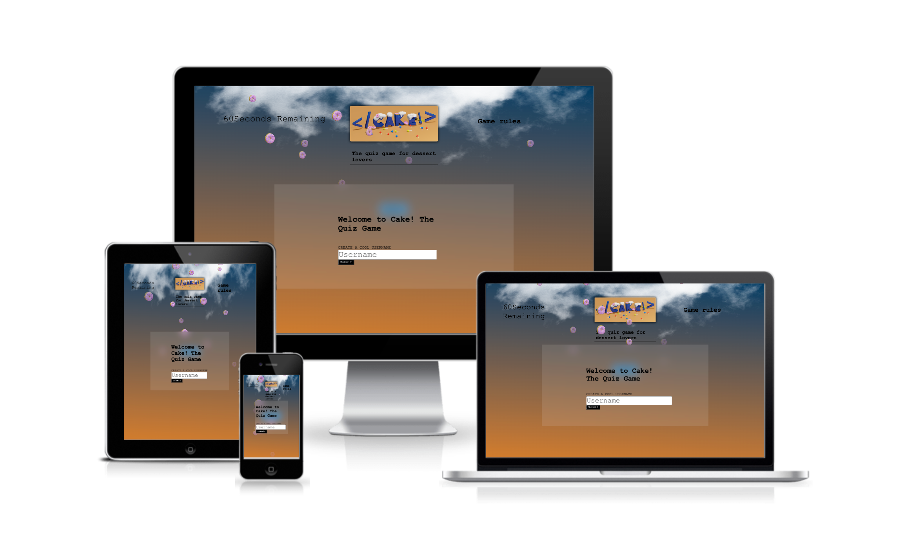
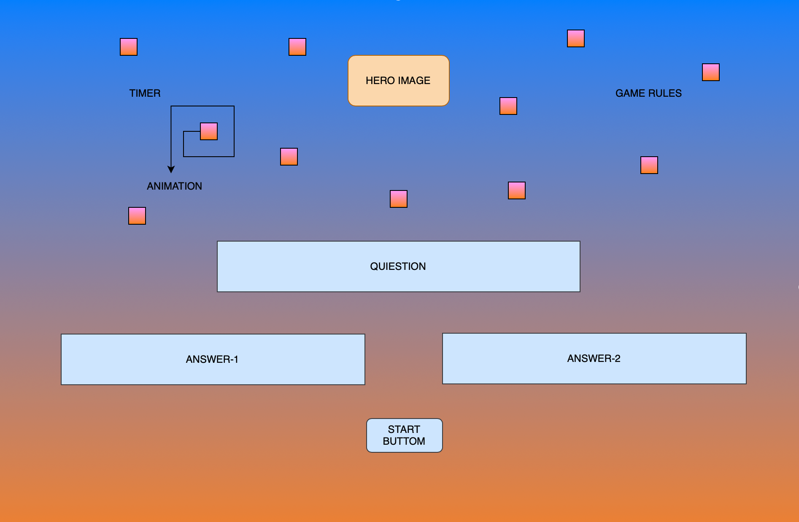
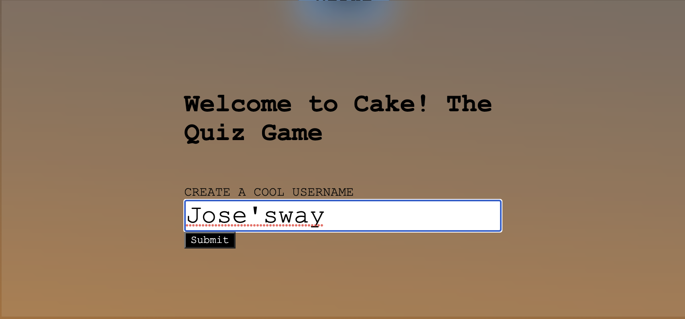
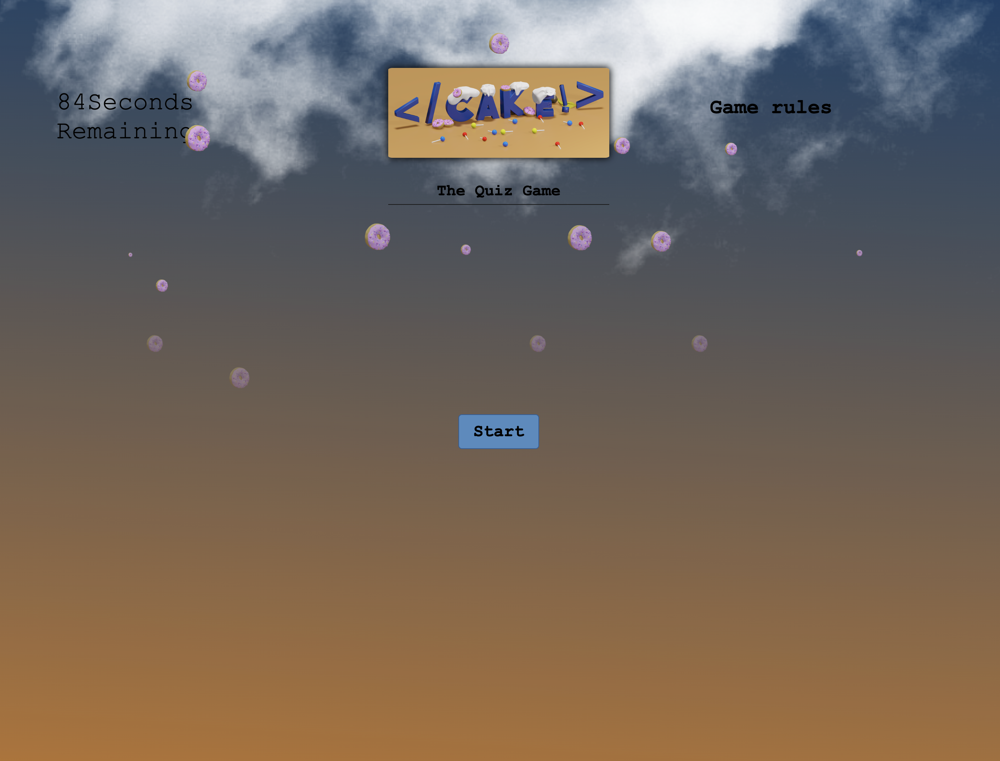
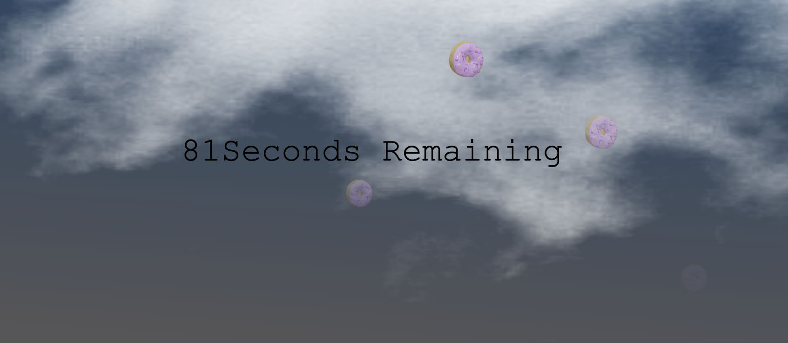
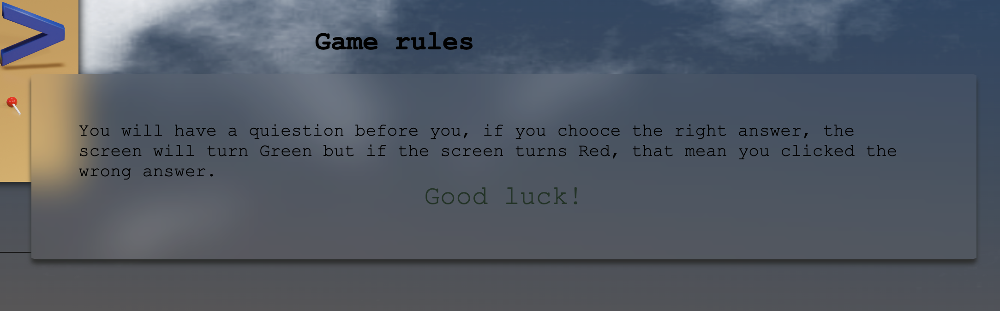

 

## **CAKE! The Quiz Game is an interactive quiz game for pastry lovers or any user with a basic knowledge of pastry arts.**

# Strategy Plane

- This interactive game's goal is to be fun, visually apealling to the eyes and also a little bit challenging. This game has 3 back gound colours, blue as a deafult color, green that indicates that the user has chosen the right anwers and red indicates that the anwers was incorrect. On top of this i have included an orange linear gradient background color and all together makes it look like a sky a the "heat of the oven". the

# Wedsite goals

- Provide the user with an opportunity to interact with the site.
- Provide an easy undestanding of what the this wedsite is about.
- Ensure an easy navigation through the site.
- Create a matter of interest amount users.
- Educate the user.
- Instant insterest by providind artistic image and interactions.

# Who's this wedsite for
- Any one  who has an interest in the pastry world. 
- Kids or adults of all ages.

# Wireframe
## The over all design of this wedsite is mean to be "cute" and fun to make it appealing to the eye and allow the user gain inmediate interest, my goal was to create a site that is responsive and intuitive, making it easy to navigate and interect.

## **Main page**

# User Experience (UX)
## User stories
# *First Time Visitor Goals*
- As a First Time Visitor, I want to find a simple interface to undestand, to allow me play the game and have fun.
- As a First Time Visitor, I want a personalized experience with the possibility to put my name as user label.
- As a First Time Visitor, I want to understand how the game works.
- As a First Time Visitor, I want to learn more about desserts, e.g recipes, method, history, etc.
# *Returning Visitor Goals*
- As a returning visitor, I want have the possibility to spend my spare time playing a fun and educative game.

## Features

# Pregame

The first feature of this game is that the user has the oportinity to create a "Cool Username" giving them the change to make this game more personal and fun. 

# Game Section

I made the game section minimalistic and fun, keeping a color theme. 
Blue replesents the "Sky" and with an added animation, it looks like is raining Donuts. 
The orange represents the heat of the oven. i used the linear gradient property to combime the two together and maintain a cohesive site.

# The Banner

The second feature is the personalize banner, where the tittle, hero image, game rules and timer can be easily found. 
I have created my own tittle by creating a hero image using blender (A 3D software), i wanted to make the tille fun and appealing to the eye. 
I have called this game the way i did was because of a personal it means a lot to me. As I am changin career from a pastry chef to software developer i wanted to incorpora these two thing together. (Cake) I too it from my pastry chef days, the closing tags have the meaning that i have closed that chapter of my life and the exclamation mark comes from the moment you type (!) when starting a new HTML file which means a new beginning. 

## Timer
I have incorporated a timer to make this game more challenging. 

## Game Rules

I incorporated Game Rules easy the access with a hover effect, games rules can be found at any starge of the game. 

## Right or Wrong answer feedback 

I have created an easy way to give the user feedback. if they click the right answer, backward screen will turn Green, and if they click the wrong answer, backward screen will turn Red, the user will also be indicated which one is the right answer if the choose their answer isn't correct, they will know this by looking at the button's color. 

