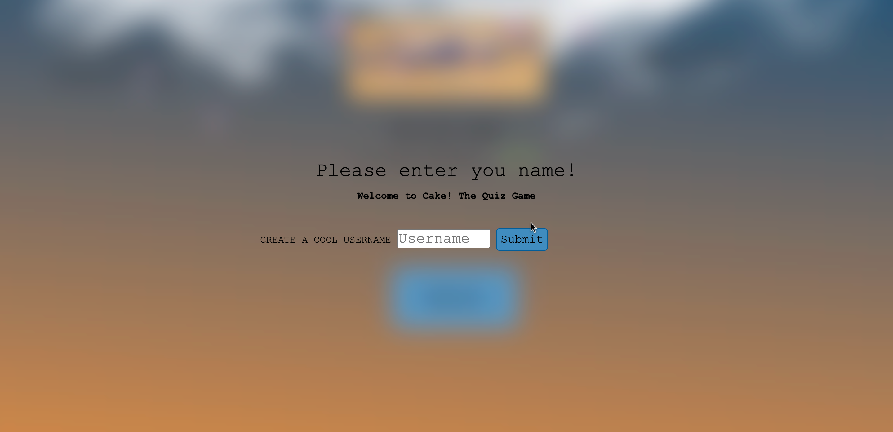
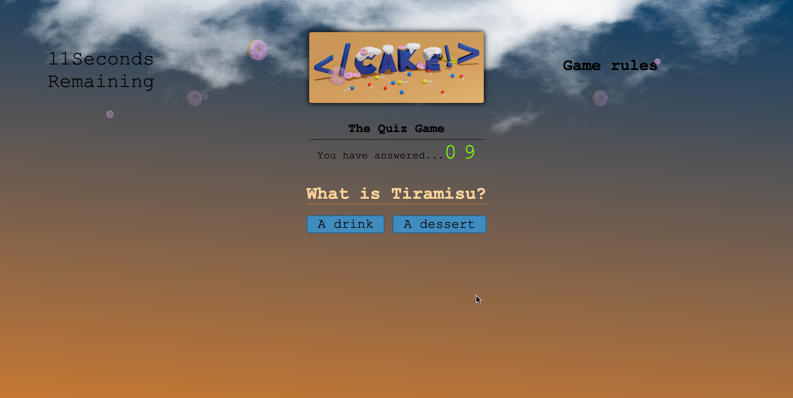
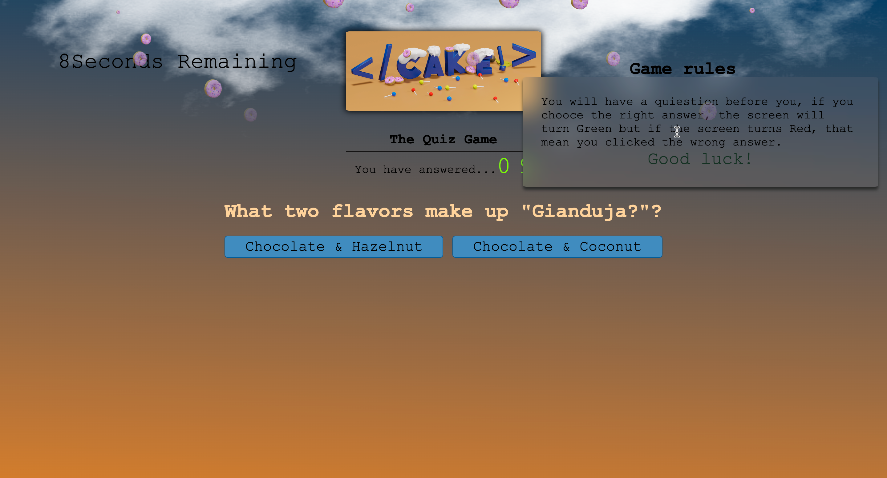
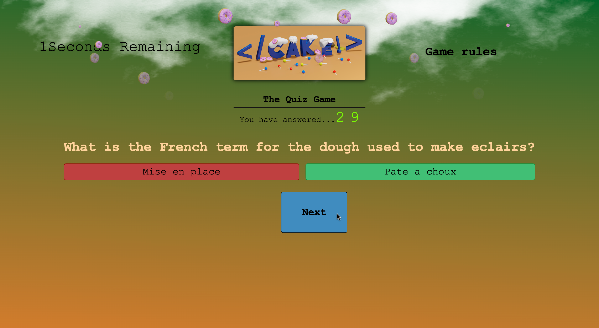
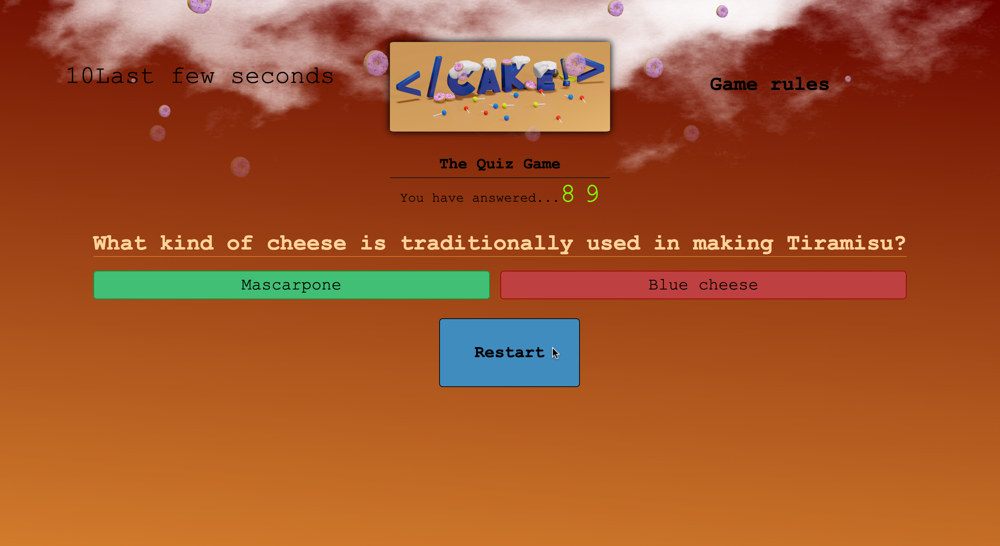
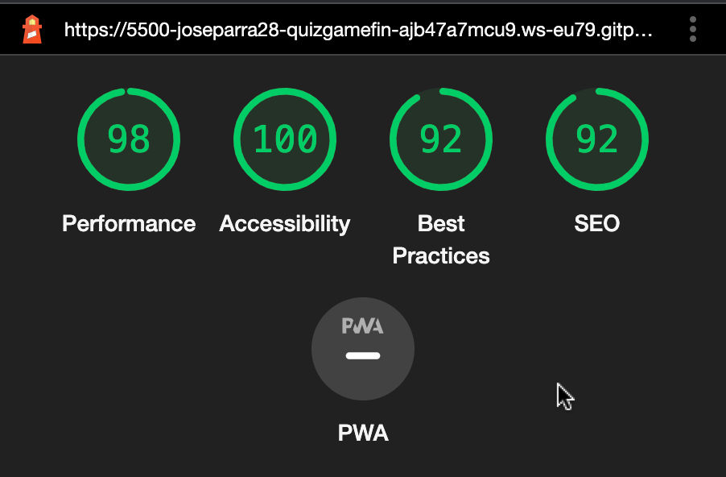

## **CAKE! The Quiz Game is an interactive quiz game for pastry lovers or any user with a basic knowledge of pastry arts.**

# Strategy Plane

- This interactive game's goal is to be fun, visually apealling to the eyes and also a little bit challenging. This game has 3 backgound colours: Blue as a deafult color, Green that indicates that the user has chosen the right anwer and Red indicates that the anwers was incorrect.

# Wedsite goals

- Provide the user with an opportunity to interact with the site.
- Provide an easy undestanding of what the this wedsite is about.
- Ensure an easy navigation through the site.
- Create a matter of interest amount users.
- Educate the user.
- Instant insterest by providind artistic image and interactions.

# Who's this wedsite for
- Any one  who has an interest in the pastry world. 
- Kids or adults of all ages.

# Wireframe
## The over all design of this wedsite is mean to be "cute" and fun to make it appealing to the eye and allow the user gain inmediate interest, my goal was to create a site that is responsive and intuitive, making it easy to navigate and interact.

## **Main page**

# User Experience (UX)
## User stories
# *First Time Visitor Goals*
- As a First Time Visitor, I want to find a simple interface to undestand, to allow me play the game and have fun.
- As a First Time Visitor, I want a personalized experience with the possibility to put my name as user label.
- As a First Time Visitor, I want to understand how the game works.
- As a First Time Visitor, I want to learn more about desserts, e.g recipes, method, history, etc.
# *Returning Visitor Goals*
- As a returning visitor, I want have the possibility to spend my spare time playing a fun and educative game.

## Features

# Pregame

The first feature of this game is that the user has the oportinity to create a "Cool Username" giving them the change to make this game more personal and fun. 
- I have created a validated for, the user can not access the game without typing at least one letter.
and if they click the Submit button, they will get a message to type their name

# Game Section

I made the game section minimalistic and fun, keeping a color theme. 
Blue replesents the "Sky" and with an added animation, it looks like is raining Donuts. 
The orange represents the heat of the oven. i used the linear gradient property to combime the two together and maintain a cohesive site.
- I have included a quiestion count, so that the user can keep track of how many questions are in the game

# The Banner

The second feature is the personalize banner, where the tittle, hero image, game rules and timer can be easily found. 
I have created my own tittle by creating a hero image using blender (A 3D software), i wanted to make the tille fun and appealing to the eye. 
I have called this game the way i did was because of a personal level it means quiet a lot to me. As I am changing career from a pastry chef to software developer i wanted to incorporate these two thing together. The name (</Cake!>) was inpired by my pastry chef days, the closing tags represent the closure of that chapter of my life as i am no longer a pastry chef and the exclamation mark represent the moment you type (!) when starting a new HTML file which means, new beginning to the software world. 

## Timer
I have incorporated a timer to make this game more challenging. 
When there are 10 seconds remaing, the user will get a massegu to let them know that how much time they have left.
When the timer gets to 0 the page will refresh and restart the game. 
In addition, once the user anwers all the quiestion, they will have the change to restart the game. Only if they answer all the quiestions, but there is very little time to complete the game as part of the challenge.

## Game Rules

I incorporated Game Rules easy the access with a hover effect, games rules can be found at any stage of the game. 

## Right or Wrong answer feedback 

I have created an easy way to give the user feedback. if they click the right answer, backward screen will turn Green, and if they click the wrong answer, backward screen will turn Red, the user will also be indicated which one is the right answer if the choose their answer isn't correct, they will know this by looking at the button's color. 
The user can click on the wrong answer once they get feedback if they have answered correctly.
I have not included a score tracking system as that is not the goal of this game, the game is meant to be aducational and the user can play as many times as they want without feeling defeated. 

## Right answer

## Wrong answer

# Testing
## Validator tasting 

- HTML
   - Tested the code returning 0 errors https://validator.w3.org/nu/#textarea

- CSS
   - Tested the code returning 0 errors https://jigsaw.w3.org/css-validator/validator

- JavaScript
   - Tested the code returning 0 errors.
   - There are 17 funtions in this file.
   - Function with the largest signature take 2 arguments, while the median is 0.5.
   - Largest function has 8 statements in it, while the median is 2.
   - The most complex function has a cyclomatic complexity value of 2 while the median is 1.
   https://jshint.com/

# Accessibility
- I confirm that after passing through the Lighthouse in devtool the font choose is clearly readable.

# Performance

# Bugs
- No bugs were found during this project

# Deployment
- The site was deployed to GitHub pages. The steps to deploy are as follows:
   - In the GitHub repository, navigate to the Settings tab
   - From the source section drop-down menu, select the Pages
   - Once the Pages has been selected, the page will be automatically refreshed with a detailed ribbon display to indicate the successful deployment.
## Link

 - The live link can be found here: https://joseparra28.github.io/quiz-game-final-project/

 # Credits
## Content

- The code for the quiz game was inpired by Youtuber Web Dev Simplified: https://www.youtube.com/watch?v=riDzcEQbX6k&t=1061s
- Font familly was taken from Google fonts.
- Tutorials of how to use Blender were from: https://www.youtube.com/c/BlenderGuruOfficial
- Cloud image was taken from Youtuber "Online Tutorials": https://www.youtube.com/watch?v=FWW38GuIo7M

# Media
- All images were created by myself using Blender

# Favicon
- Favicon was created by mymyself using Blender

# Reference Material
- Used W3School to deepen some topic for site improving such as Javascript timer, funtions, and hidding content.
- I used W3 School to learn about CSS animations ans hover effects.
- I use Udemy online school to lear how to create 3D images on Blender

# Acknowledgements
I would like to thank my mentor Jubril Akolade who providel mentoring during the development of this project giving me valuable advice on how improve the site from start to finish.

